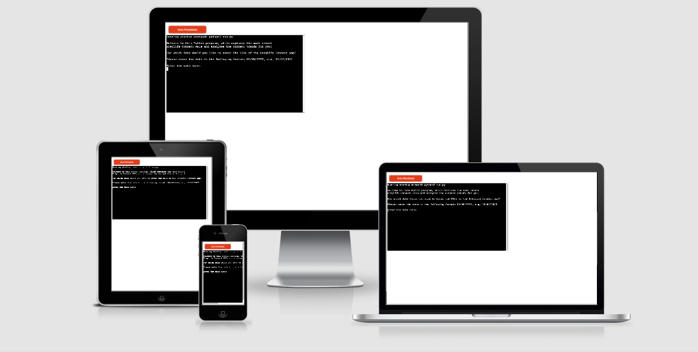

# Preglife Connect KPI Capture

While thinking about what to do for my 3rd milestone project, I decided against creating a random game or program, but instead wanted to build something that is useful to me in my daily work with my app startup Preglife Connect. I am responsible for keeping track of the app's user development, so I decided that a KPI (Key Performance Indicator) capture program, which also informs me about current trends, could be really useful to build. 

[Here you can find the deployed project](https://preglife-connect-kpis-msp3.herokuapp.com/)

## Initial planning

- In the next section I will talk more about the features of the program and how to use it. 
- Just note that I basically adhered to my initial concept of how and when the individual functions/features should be executed within the code.

## Features / How to use

### 0. Setup and Google Sheet connection

- The setup was in large parts similar to the setup of the LoveSandwiches project here within CodeInstitute.
- The Python file needed to be connected to the Google Sheet via an API connection. This was done with the help of the Google Cloud Platform and by importing 'gspread' and 'google.oauth2.service_account'

### 1. Introduction and capture a date

- In this part of the program the user is welcomed and then the program requests a date from the user, for which app KPIs should be entered. 
- The user is also told what kind of format the date should have. 
- The user then enters a date and proceeds to the next part of the program.

### 2. Date Validation

- First of all, the date is validated. This means that I check if the given date is present in the long list of potential dates within the Google Sheet.
- Second, I grab all the last 30 values for each KPI and check if there are any missing entries. 
    - if no entry is missing, I tell that to the user and praise him
    - if some days' entries are missing, I tell the user to be more consistent, but still keep running the program
    - if no values have been entered in the past 30 days, I tell the users that I need her/him to enter values for previous dates first and rerun the program

### 3. User enters KPIs + Validation

- The user is asked to enter 5 KPIs for the date that was provided earlier.
- Those inputs are validated after each individual input. The input must be a positive integer. If that is not provided, the user will be made aware of the mistake and be prompted to enter the input again.
- Finally, the user is praised for providing valid input.

### 4. Updating worksheet + Trend evaluation

- At first the user is told that the Google Sheet is currently updating. Another message is printed after that has been done successfully.
- Now the interesting part for the user begins: calculations will be made in the background and then the user is given some information about the current KPI development and trends.
    - at first the KPI is returned to the user, which performed the worst, compared to the average of the past 30 days (incl. the exact %-change)
    - then the KPI is returned to the user, which performed the best, compared to the average of the past 30 days (incl. the exact %-change)
    - lastly the user will get a message about how all 5 KPIs have developed overall; this message depends on how many KPIs have developed positively 
- Lastly, the program thanks the user and prompts her/him to come back tomorrow.

### Future Features

- In the future, I would love to connect this program to Google Analytics, to pull out the relevant 5 KPIs itself. Then I could just run the program to get the current trends.

## Data Model

My data is captured and modelled in a Google Sheets document. The document contains 6 columns, one for the dates and 5 for the respective KPIs. When the user chooses to enter data for a certain date, the columns B-F of the respective row of the given date are populated with the inputted KPI data. The date's data can be overwritten, simply by running the program again and using a date that was used before.

I decided to structure my program using functional programming. I did not use OOP in this program.

## Testing

I have manually tested this program by doing the following:
- passed the code through a PEP8 linter and confirmed there are no problems
- tested the date validation with all kinds of different dates and also with wrongly formatted dates
- tested the KPI input with text, floats and negative numbers, to confirm that the program won't allow it
- have run the code several times to make sure that the connection to the Google Sheet works and that the KPIs are written to the sheet
- have checked that all the calcualtions are done correctly and based on the right columns'/rows' values
- tested in my own Gitpod terminal and in the CodeInstitute's Heroku terminal

### Bugs

- It took me a long time to figure out how to re-run my program in case the user had chosen a date that had no KPI entries in the past 30 days, which was leading to a ZeroDivisionError. With some input of my colleague Daniel I could figure it out eventually.
- It also took me extremely long to figure out how to grab a range of values from the Google Sheet, which have a certain relative postition compared to the cell of the date input. I could eventually solve it with the Gspread documentation (which gave me a coder's high)!
- no bugs are left unfixed

### Validator testing

- PEP8
    - no errors were returned from [pep8online.com](http://pep8online.com/)

## Deployment

This project was deployed using CodeInstitute's mock terminal for Heroku.

- Steps for deployment
    - Create a new Heroku account or login to an existing account and click on 'Create New App'
    - Name the app and choose your region
    - Go to Settings and click on 'Reveal cofig vars'
        - Write CREDS in the KEY field and copy the content of the creds.json file into the VALUE field and click add
        - Write PORT in the next KEY field and write 8000 into VALUE field and click add
    - Go to the Buildpacks section below and click on Add Buildpack; add Python and NodeJS in that order
    - Click on 'Deploy' in the Navbar and then click on 'Connect to Github'; enter the repository name and connect it
    - Scroll down and do a manual deploy of the main branch; Heroku will inform you when the program was deployed and provide you with a button to the app

## Credits

- CodeInstitute for the deployment terminal
- my mentor Antonio for the great help and feedback throughout the process
- my colleague/co-founder Daniel for helping me to understand a few main concepts within my code (e.g. recursion)
- my friend Sam for checking my code and giving me feedback
- all other websites and documentations that have been used in the project are credited within the code